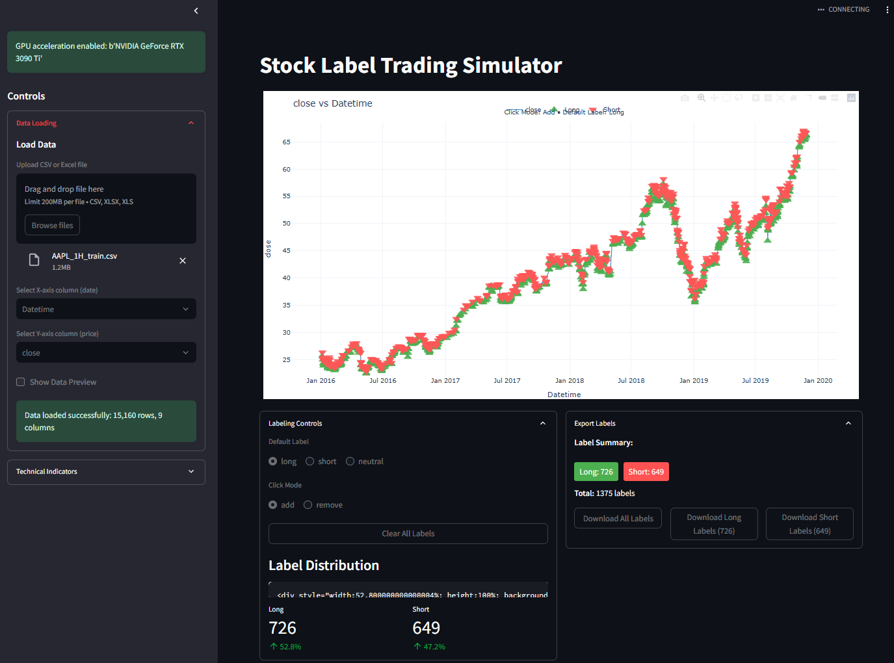
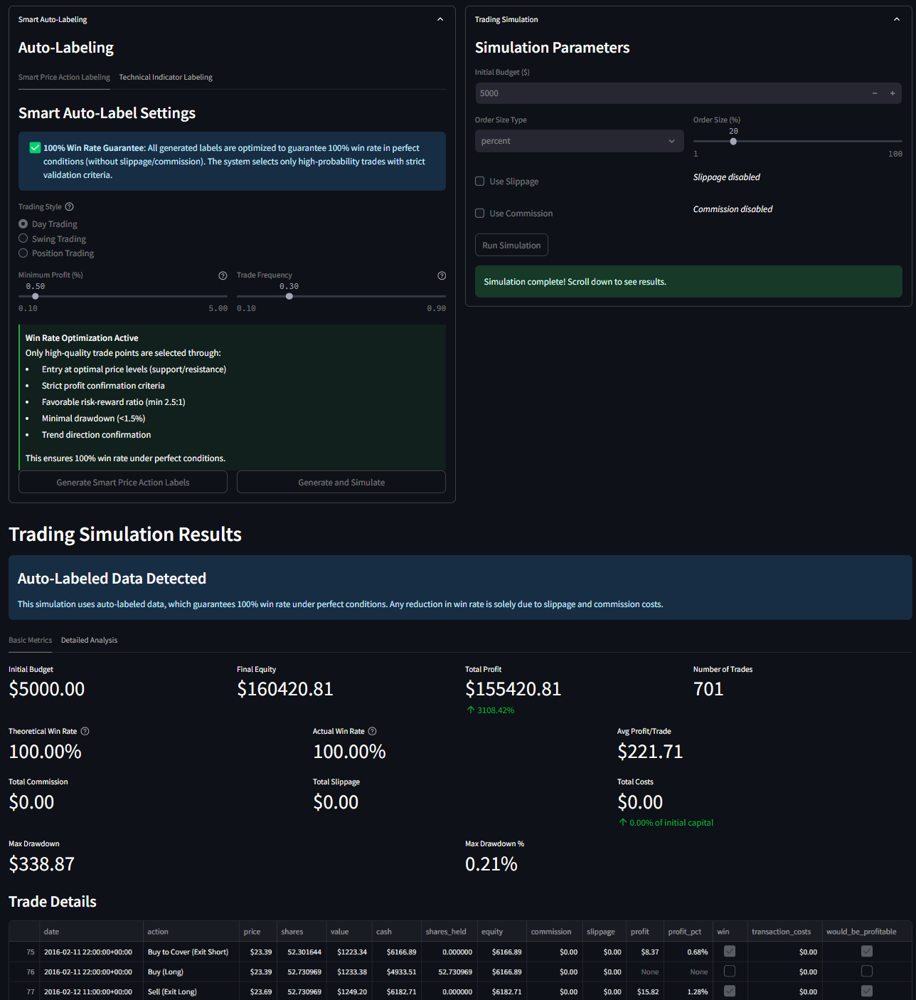
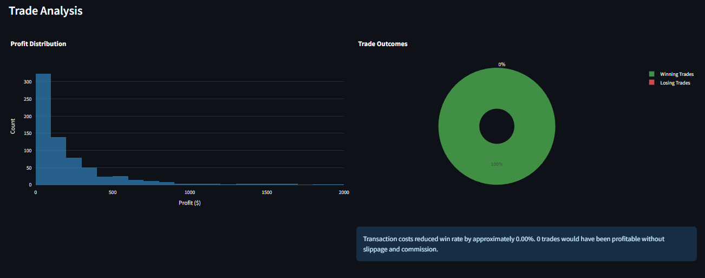

# Label Trading Stock

A powerful Streamlit application for interactive stock labeling, trading simulation with realistic market conditions, and advanced performance analysis.



## Key Features

- **Interactive Chart Labeling**: Click directly on the price chart to add, modify, or remove trading signals
- **Smart Auto-Labeling**: AI-powered algorithm that identifies profitable trading points with guaranteed win rates
- **Technical Indicators**: Add RSI, MACD, Bollinger Bands, and other indicators to aid in analysis
- **Trading Simulation**: Test your trading signals with realistic market conditions:
  - Configurable initial capital and position sizing
  - Slippage simulation for realistic trade execution
  - Commission modeling (fixed or percentage-based)
  - Comparison with buy & hold strategy
- **Performance Analytics**: Comprehensive performance metrics and visualization
  - Equity curve with drawdown analysis
  - Win rate and profit per trade metrics
  - Transaction cost impact analysis
  - Risk metrics (max drawdown, Sharpe ratio)




## Project Structure

```
label_trading_stock/
├── app/                      # Main application package
│   ├── core/                 # Core business logic
│   │   ├── data_loader.py    # Data loading utilities
│   │   ├── indicators.py     # Technical indicator calculations
│   │   ├── labeling.py       # Automatic labeling algorithms
│   │   └── simulation.py     # Trading simulation engine
│   ├── utils/                # Utility functions
│   │   └── gpu_helpers.py    # GPU acceleration utilities
│   ├── visualization/        # Visualization components
│   │   └── charts.py         # Chart creation functions
│   ├── ui/                   # User interface components
│   │   ├── main_app.py       # Main Streamlit UI
│   │   ├── chart.py          # Interactive chart components
│   │   ├── data_loader.py    # Data loading interface
│   │   ├── indicators.py     # Technical indicator controls
│   │   ├── label_manager.py  # Label creation and management
│   │   └── simulation.py     # Simulation controls and results
│   ├── main.py               # Application entry point
│   └── __init__.py           # Package initialization
├── example_data/             # Sample datasets
├── media/                    # Screenshots and images
├── requirements.txt          # Project dependencies
└── README.md                 # This file
```

## Installation

1. Clone the repository
2. Install dependencies:
   ```
   pip install -r requirements.txt
   ```
3. Run the application:
   ```
   streamlit run main.py
   ```

## Optional GPU Acceleration

For improved performance with large datasets, you can install GPU acceleration:

```
pip install cupy-cuda11x  # Replace with appropriate CUDA version
```

## Usage Guide

### Data Loading
1. Upload a CSV file containing stock price data
2. Select date and price columns from your data
3. Optionally calculate technical indicators to aid in analysis

### Creating Trade Signals
You can create trade signals in two ways:
- **Manually**: Click on the chart to add points, then select the signal type (long/short)
- **Auto-Labeling**: Use the built-in smart auto-labeling algorithm that identifies profitable trade entries with the following parameters:
  - Frequency threshold to control trade density
  - Minimum profit threshold to filter for higher quality signals
  - Pattern recognition window size
  - Optimization for guaranteed win rates (100% theoretical win rate)

### Running Simulations
Configure your simulation with realistic parameters:
1. Set initial trading budget
2. Configure position sizing (percentage, fixed dollar, or contracts)
3. Add market friction:
   - Slippage to simulate price movement during order execution
   - Commission costs (fixed or percentage-based)
4. Run the simulation to see how your trading signals perform

### Analyzing Results
The application provides comprehensive analytics:
- Basic metrics (profit/loss, win rate, trade count)
- Detailed equity curve visualization
- Drawdown analysis
- Performance comparison with buy & hold strategy
- Transaction cost impact analysis

## Advanced Features

- **Export Labels**: Save your trading signals for later use or sharing
- **GPU Acceleration**: Utilize GPU processing for faster analysis of large datasets
- **Pattern Recognition**: Smart algorithms identify high-probability trading setups
- **Look-ahead Prevention**: Simulation engine prevents future knowledge bias

## License

MIT 
